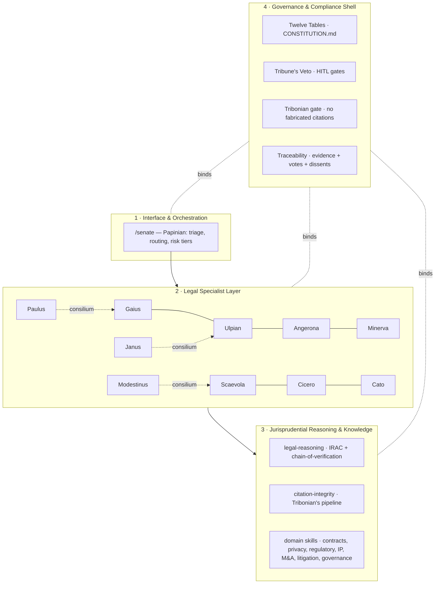

# SENATE — The Curia Crown

> *A curia of jurists: Greek wisdom above, Roman law below.*
>
> A PhD-level legal wing of AI agents — twelve jurists who draft, verify,
> deliberate, and dissent under a constitution they cannot amend. Standalone
> in any agent harness; plug-and-play as Hydra's legal squad when Hydra is
> present.

---

## Why a Senate

Every other wing of the constellation creates something: the Executive Crown
decides, the Forge builds, the Garland sings. The Senate **binds** — it is the
wing that asks *"may we?"* before the others ask *"can we?"*, and it does so
with the depth of a working legal department, not the altitude of a single
general counsel.

The mythos is chosen with intent. In **426 AD** the *Law of Citations* (Lex
Citationum) resolved a real multi-agent problem: when the great jurists'
writings conflicted, which opinion governed? Rome's answer — **the majority of
jurists prevails; when divided, Papinian breaks the tie; dissents stay on the
record** — is a 1,600-year-old precedent for exactly what a multi-agent legal
system must do. The Senate runs that protocol natively. Its constitution is
the **Twelve Tables**, posted publicly so no one is ruled by secret law. Its
human-in-the-loop gate is the **Tribune's Veto** (*intercessio*) — the one
voice no magistrate could overrule.

Beside its siblings: Hydra speaks Greek myth (the many-headed, one-souled),
AgentSmith speaks the Matrix (the immune system), TheEights speaks the I Ching
(the memory beneath), RLM-Creative speaks in Muses. The Senate answers them in
Latin — the language law still dreams in.

## The Roster

| Jurist | Slug | Tier | Authority | Domain |
|---|---|---|---|---|
| **Papinian** | `general-counsel` | opus | gatekeeper | Crew lead — triage, deliberation, tiebreak, synthesis |
| **Gaius** | `contract-counsel` | sonnet | execute | Contracts: redline, clause risk, playbooks |
| **Ulpian** | `regulatory-counsel` | sonnet | execute | Regulatory: EU AI Act, MiCA, GDPR, SOX, HIPAA, sectoral |
| **Angerona** | `privacy-counsel` | sonnet | gatekeeper | Privacy: DPIA, TIA, cross-border transfers, breach |
| **Minerva** | `ip-counsel` | sonnet | gatekeeper | IP: FTO, prior art, trademark, OSS licenses |
| **Scaevola** | `mna-counsel` | sonnet | execute | M&A: diligence, red flags, SPA/APA, R&W heatmaps |
| **Cicero** | `litigation-counsel` | sonnet | execute | Disputes: case assessment, privilege, settlement |
| **Cato** | `governance-counsel` | sonnet | advisory | Governance: fiduciary, board, ESG, AI oversight |
| **Tribonian** | `citation-verifier` | sonnet | gatekeeper | Research + citation verification — the anti-hallucination gate |
| **Paulus** | `employment-counsel` | sonnet | execute | *Consilium* (under Gaius): employment & labor |
| **Modestinus** | `tax-counsel` | sonnet | advisory | *Consilium* (under Scaevola): tax aspects of deals |
| **Janus** | `export-controls` | sonnet | gatekeeper | *Consilium* (under Ulpian): sanctions, export, borders |

Nine heads sit the Curia; three junior counsel (the *consilium*) serve under
their parent jurists, the way Helios's sub-crew serves the Garland.

## Architecture

The Senate implements the four-layer design of the research document
(*PhD-Level Legal Wing for an Enterprise AI Agent Mesh Platform*):



**Deliberation (the Law of Citations).** `/senate` runs: Papinian triages →
relevant jurists draft opinions in parallel → Tribonian verifies every
authority → the Curia weighs (majority; Papinian breaks ties; dissents
verbatim) → gates fire (Tribune's Veto where required) → one auditable
DECISION_RECORD, filed to `output/`.

## Quickstart — standalone (any harness)

The Senate has **zero hard dependencies**. Any harness that can read markdown
agents/skills can drive it; MCP tools (memory, Hydra) are optional enrichments
that degrade gracefully.

```text
# in C:\AiAppDeployments\Senate with Claude Code (or any compatible harness)
/senate-roster                                  # see the Curia
/legal-opinion contract-counsel "Is a unilateral NDA right for this vendor pilot?"
/contract-review <path-or-pasted contract>      # Gaius-led redline
/senate "Assess GDPR + APPI exposure for the new telemetry pipeline"   # full deliberation
```

Outputs land in `output/<domain>/<topic>-YYYY-MM-DD.md`, each carrying the
privilege banner, the authority list (verified/unverified flags), votes,
dissents, and the Article VI notice.

## Quickstart — with Hydra

When Hydra is present, the Senate is the **`legal-compliance`** squad (the
Curia Crown), `entrypoint: claude-skill`:

```text
/hydra:run "Review the vendor MSA for the EU rollout — data processing terms included"
# router fingerprints (contract, gdpr, redline, counsel, …) select legal-compliance
# Hydra dispatches /senate with a HANDOFF envelope; Papinian returns a DECISION_RECORD
```

- **Envelopes**: accepts `HANDOFF`, `C_SUITE_DECISION_PACKET`, `PRD`,
  `CREATIVE_BRIEF`; emits `DECISION_RECORD`, `HITL_REQUEST`.
- **Gates**: privacy-by-design, EU-AI-Act classification, OSS-license
  compatibility, compliance coverage, citation integrity, ABA-512 ethics —
  the HITL-required ones pause as the Tribune's Veto.
- **Shim**: Hydra's `mcp_servers/senate/` exposes
  `senate.roster.list / senate.agent.get / senate.command.* / senate.output.*
  / senate.ping` (the ExecutiveSuite pack-shim pattern).

## The Constellation

| System | Mythos | Senate's relationship |
|---|---|---|
| **Hydra** | Greek — many heads, one soul | Fourth crown (Curia) beside Executive, Forge, Garland |
| **ExecutiveSuite** | The boardroom | CLO (Themis) consumes Senate work; Senate is the legal *department* under the CLO's *judgment* — see `integrations/executive-suite.md` |
| **AgentSmith** | The Matrix | Validates Senate artifacts; Senate defers to N1–N10 |
| **TheEights** | I Ching | Precedent memory (Dui), legal-risk audit (Kan); evolution gate for any change to the Senate itself |
| **pair-programmer** | The Forge | Senate supplies OSS-license/IP/contract guardrails to engineering |
| **RLM-Creative** | The Muses | Minerva clears IP for creative assets |
| **MarketBliss** | Marketing ops | Regulated-claims review; escalation target for brand-safety-compliance |
| **Xenia** | Greek guest-friendship | Future customer-support wing (doc-stage peer) |

## Roadmap (from the research document)

- **Phase 1 (now)** — knowledge + protocol: the 12 jurists, 11 skills, rubric
  gates, Curia deliberation, Hydra integration. No live legal databases.
- **Phase 2** — retrieval depth: contract/clause RAG, regulatory norm graphs
  (Graph-RAG over GDPR / EU AI Act / MiCA / APPI), CUAD-style clause
  classification, best-of-N legal drafting with Borda judging in Hydra.
- **Phase 3** — calibrated autonomy: LegalBench/LEXam continuous evaluation,
  LegalSim-style procedural simulation, narrow pre-approved autonomy (e.g.
  non-material NDA renewals) under full logging and the Tribune's Veto.

**KPIs** track legal quality, not automation rate: precision/recall vs. human
baseline on review tasks, citation-verification pass rate, cycle-time
reduction, and **zero** privilege breaches or unauthorized-practice incidents.

## Repository layout

```
Senate/
├── CONSTITUTION.md          # The Twelve Tables (immortal head)
├── README.md                # this file
├── AGENTS.md                # harness-agnostic behavioral contract
├── CLAUDE.md                # Claude Code shim → @AGENTS.md
├── squad.yaml               # Hydra squad pack (source side)
├── heads.yaml               # Curia roster matrix
├── hooks.json               # session hooks
├── .claude/
│   ├── agents/              # 12 jurists
│   ├── skills/              # 11 skills
│   ├── commands/            # 9 commands
│   ├── rubrics/             # 8 gate rubrics
│   └── settings.json
├── integrations/            # 7 sibling-system contracts
└── output/                  # counsel-work-product, by domain
```

---

*Fiat justitia — through verified citations, weighed opinions, and a veto
no agent can override.*
